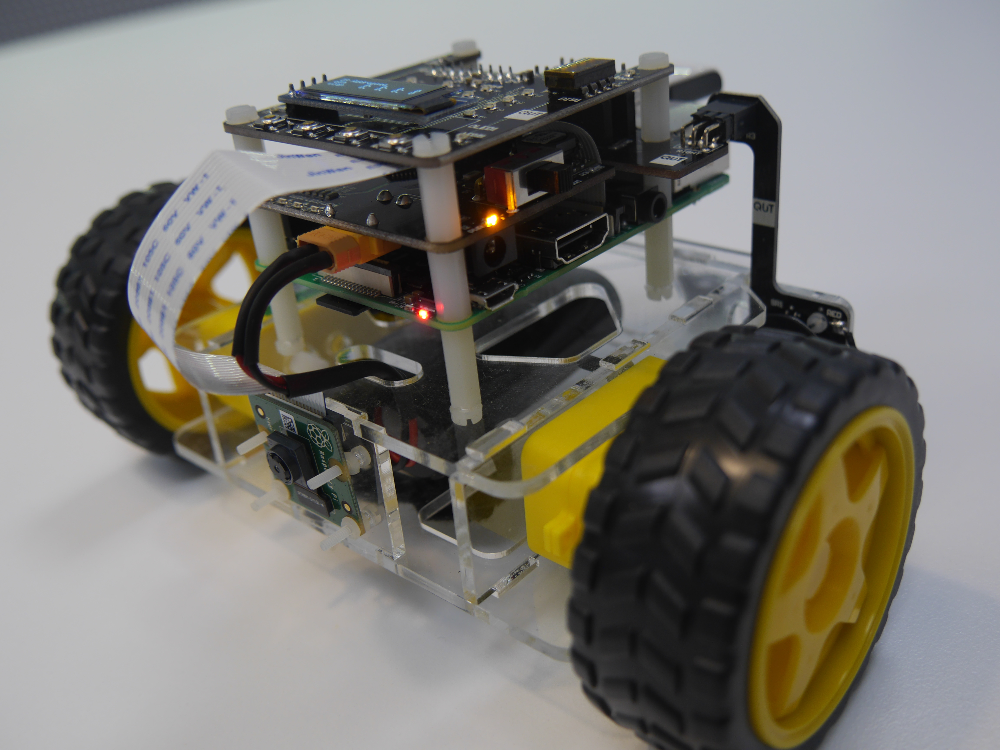

# Robotic Navigation and Vision Prereading
|               **Quick Links**            |
|         [The Task](The_Task.md)         |
| [Matlab Refresher](Matlab_Refresher.md) |
|       [Robot Code](Robot_Code.md)       |
|       [Final Code](Final_Code.md)       |

---
This site includes some details for a robotics workshop using the [Penguin Pi Robot's](https://cirrusrobotics.com.au/products/penguinpi/) produced by QUT. This session is aimed at high school students, though the topics covered are complex. 

